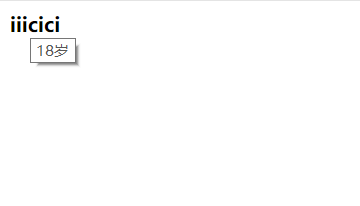
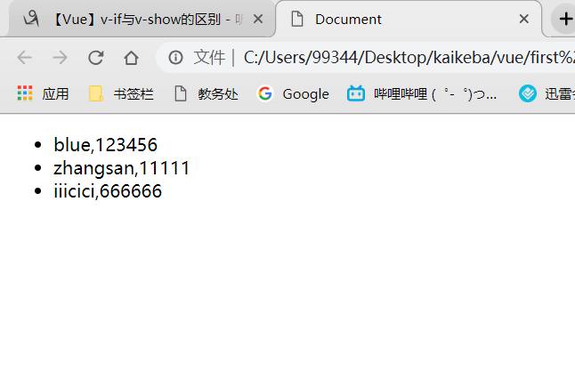
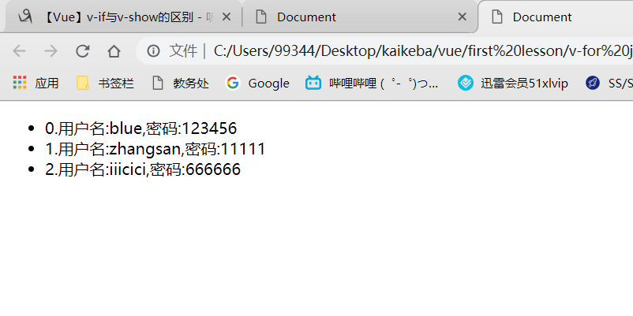
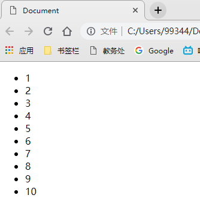
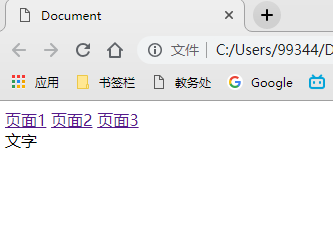
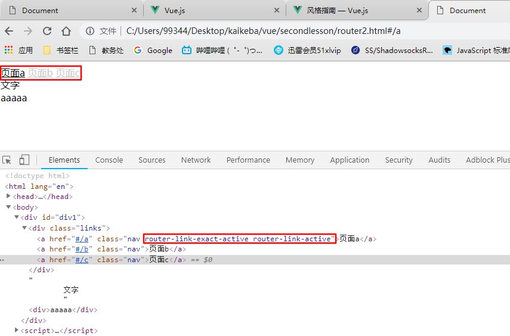

# Vue

## 指令

- 指令(directive)--补充了html的属性

### v-bind:

`v-bind:`

> 可以用于任何属性
>
> 可以直接简写成`:`

```html
<script src="vue.js"></script>


<div id="div1">
    <strong v-bind:title="age+'岁'">{{name}}</strong>
</div>
<script>
    let vm = new Vue({
        el:'#div1',
        data:{
            age: 18,
            name: 'iiicici'
        }
    })
</script>
```




> 有两个属性有另外的写法
>
> class,style属性
>
> `v-bind:class=""`和`v-bind:style=""`可以接收`字符串和数组`

> class_array: ['aa', 'bb', 'v', 'cc']
>
> class_str: 'aa bb cc active'

```html
<div id="div1">
    
    <div :class="class_array"></div>
    <div :class="class_str"></div>
</div>

<script>
    let vm = new Vue({
        el: '#div1',
        data: {
            url: 'https://ss1.baidu.com/6ONXsjip0QIZ8tyhnq/it/u=3101490607,4089794115&fm=58&bpow=400&bpoh=660',
            class_array: ['aa', 'bb', 'v', 'cc'],
            class_str: 'aa bb cc active'
        }
    })
</script>
```


> style_str: 'width:200px;height:200px;background:yellow',
>
> style_json: { width: '200px', background: 'green', height: '200px' }

```html
<div id="div1">
    <div v-bind:style="style_str"></div>
</div>
<script>
    let vm = new Vue({
        el: '#div1',
        data: {
            style_str: 'width:200px;height:200px;background:yellow',
            style_json: { width: '200px', background: 'green', height: '200px' }
        }
    })
</script>
```


### v-model

`v-model`数据双向绑定

> 数据(data)和input之间双向绑定
>
> 输入组件才能使用
>
> v-model进来的数据, 都是字符串


```html
<body>
    <div id="div1">
        <input type="text" name="" id="" v-model="n1">+
        <input type="text" name="" id="" v-model="n2">=
        <span>{{sum()}}</span>
    </div>
    <script>
        let vm = new Vue({
            el: '#div1',
            data: {
                n1: 0,
                n2: 10,
            },
            methods: {
                sum() {
                    return parseInt(this.n1)+parseInt(this.n2);
                }
            }
        })
    </script>
</body>
```

### v-text

`v-text`直接输出html代码

```html
<body>
    <div id="div1">
        <div v-text="str"></div>
        <!-- <div>{{str}}</div> 和这样写效果一样, 这样里面还可以加别的内容-->
    </div>
    <script>
        let vm = new Vue({
            el: '#div1',
            data: {
                str: '<p>11月26日，一段题为“张家口经开区国土局局长接访时玩手机”的视频在网络平台流传。</p>',
            }
        })
    </script>
</body>
```


### v-html

`v-html`innetHTML

```html
<body>
    <div id="div1">
        <div v-html="str"></div>
    </div>
    <script>
        let vm = new Vue({
            el: '#div1',
            data: {
                str: '<p>11月26日，一段题为“张家口经开区国土局局长接访时玩手机”的视频在网络平台流传。</p>',
            }
        })
    </script>
</body>
```


## 事件

- vue事件

### v-on:

`v-on:`

> v-on:click="fn(x,x,x...)"
>
> 简写
>
> @click="fn(x,x,x...)"

```html
<body>
    <div id="div1">
        <span>{{a}}</span>
        <input type="button" value="+1" v-on:click="sum(3)">
        <!--<input type="button" value="+1" @click="sum(3)"> 简写方式-->
    </div>
    <script>
        let vm = new Vue({
            el: '#div1',
            data: {
                a: 1,
            },
            methods: {
                sum(b) {
                    this.a += b;
                }
            }
        })
    </script>
</body>
```

### v-show

`v-show`display

```html
<style>
    .box {
        width: 300px;
        height: 300px;
        background-color: #ccc;
    }
</style>
<script src="vue.js"></script>


<div id="div1">
    <input type="button" value="显示隐藏" @click="commit()">
    <div class="box" v-show="a"></div>
</div>
<script>
    let vm = new Vue({
        el: '#div1',
        data: {
            a: true,
        },
        methods: {
            commit() {
                this.a = !this.a;
            }
        }

    })
</script>
```


> 显示


> 隐藏


### v-if

`v-if`删除元素

```html
<style>
    .box {
        width: 300px;
        height: 300px;
        background-color: #ccc;
    }
</style>
<script src="vue.js"></script>


<div id="div1">
    <input type="button" value="显示隐藏" @click="commit()">
    <div class="box" v-if="a"></div>
</div>
<script>
    let vm = new Vue({
        el: '#div1',
        data: {
            a: true,
        },
        methods: {
            commit() {
                this.a = !this.a;
            }
        }

    })
</script>
```

> 显示


> 隐藏, 会直接删除元素


### v-for

`v-for`

> 1.数组  v-for="item,index in array"

```html
<div id="div1">
    <ul>
        <li v-for="a in users">{{a.name}},{{a.password}}</li>
    </ul>
</div>
<script>
    let vm = new Vue({
        el: '#div1',
        data: {
            users: [
                { name: 'blue', password: '123456' },
                { name: 'zhangsan', password: '11111' },
                { name: 'iiicici', password: '666666' }
            ]
        }
    });
</script>
```



> 2.json v-for="val,key in json"

```html
<div id="div1">
    <ul>
        <li v-for="user,index in users">{{index}}.用户名:{{user.name}},密码:{{user.password}}</li>
    </ul>
</div>
<script>
    let vm = new Vue({
        el: '#div1',
        data: {
            users: [
                { name: 'blue', password: '123456' },
                { name: 'zhangsan', password: '11111' },
                { name: 'iiicici', password: '666666' }
            ]
        }
    });
</script>
```



```html
<div id="div1">
    <ul>
        <li v-for="val,name in style">{{name}}:{{val}}</li>
    </ul>
</div>
<script>
    let vm = new Vue({
        el: '#div1',
        data: {
            style: {
                width: '200px',
                height: '300px'
            }
        }
    })
</script>
```


> `:key`属性
>
> 1.不能重复
>
> 2.不能变

```html
<div id="div1">
    <ul>
        <li v-for="user in users" :key="user.id">用户名:{{user.name}},密码:{{user.password}}</li>
    </ul>
</div>
<script>
    let vm = new Vue({
        el: '#div1',
        data: {
            users: [
                { id: 1, name: 'blue', password: '1111' },
                { id: 2, name: 'aaa', password: '2222' },
                { id: 3, name: 'cici', password: '3333' }
            ]
        }
    })
</script>
```


> 3.字符串 v-for="char,index in str"

```html
<div id="div1">
    <ul>
        <li v-for="s in str">
            {{s}}
        </li>
    </ul>
</div>
<script>
    let vm = new Vue({
        el: '#div1',
        data: {
            str:'sghjkl'
        }
    })
</script>
```


> 4.数字 v-for="i in num"

```html
<div id="div1">
    <ul>
        <li v-for="i in 10">
            {{i}}
        </li>
    </ul>
</div>
<script>
    let vm = new Vue({
        el: '#div1',
        data: {

        }
    })
</script>
```




### v-pre

> 提高性能
>
> 防止意外

### v-cloak

```html
<script src="vue.js" charset="utf-8"></script>
<style media="screen">
    *[v-cloak] {display:none}
</style>
</head>
<body>
    <div id="div1" v-cloak>
        {{a}}, {{b}}
    </div>
</body>
<script src="1.php" charset="utf-8"></script>
<script>
    let vm=new Vue({
        el: '#div1',
        data: {
            a: 12, b: 5
        }
    });
</script>
```

> 1.php

```php
<?php
sleep(3);
?>
```


> 三秒钟之前是{{a}},{{b}}这种效果


## 数据同步

```html
<body>
    <div id="div1">
        姓名：{{name}}<br>
        年龄：{{age}}
    </div>
</body>
<script>
    let el=document.getElementById('div1');

    let template=el.innerHTML;

    let _data={
        name: 'blue',
        age: 18
    };

    let data=new Proxy(_data, {
        set(obj, name, value){
            //alert(`有人视图设置 ${name}=>${value}`);
            obj[name]=value;

            //数据变了
            //console.log('数据变了');
            render();
        }
    });

    render();

    function render(){
        el.innerHTML=template.replace(/\{\{\w+\}\}/g, str=>{
            str=str.substring(2, str.length-2);

            return _data[str];
        });
    }
</script>
```


## 双向绑定

```html
<body>
    <div id="div1">
        <input type="text" v-model="name"><br>
        姓名：{{name}}<br>
        年龄：{{age}}
    </div>
</body>
<script>
    let el=document.getElementById('div1');

    let template=el.innerHTML;

    let _data={
        name: 'blue',
        age: 18
    };

    let data=new Proxy(_data, {
        set(obj, name, value){
            //alert(`有人视图设置 ${name}=>${value}`);
            obj[name]=value;

            //数据变了
            //console.log('数据变了');
            render();
        }
    });

    render();

    function render(){
        //渲染
        el.innerHTML=template.replace(/\{\{\w+\}\}/g, str=>{
            str=str.substring(2, str.length-2);

            return _data[str];
        });

        //找所有的v-model
        Array.from(el.getElementsByTagName('input'))
            .filter(ele=>ele.getAttribute('v-model'))
            .forEach(input=>{
            let name=input.getAttribute('v-model');
            input.value=_data[name];

            input.oninput=function (){
                data[name]=this.value;
            };
        });
    }
</script>
```

## 虚拟DOM--json

```html
<ul>
  <li>
    <h2></h2>
    <p></p>
  </li>
</ul>
```

> 用json写--虚拟DOM

```json
{
    tag: 'ul',
    child: [
        {tag: 'li', child: [
            ...
        ]}
    ]
}
```

# vue-router

> 1. 容器
>
> `<router-view></router-view>`
>
> 2. 路由表
>
> ```
> let router = new VueRouter({
>     routes:[
>         {path,component},
>         {path,component},
>         {path,component},
>         ...
>     ]
> });
> ```
>
> 3. 添加到vm对象
>
> ```
> new Vue({
>     el,data,...,
>     router:router
> })
> ```
>
> 

```html
<script src="vue.js"></script>
<script src="vue-router.js"></script>

<div id="div1">
    <router-link to="/a">页面1</router-link>
    <router-link to="/b">页面2</router-link>
    <router-link to="/c">页面3</router-link>
    <div>文字</div>
    <router-view></router-view>
</div>
<script>
    //路由表
    let router = new VueRouter({
        routes: [
            {
                path: '/a',
                component: { template: '<div>aaaa</div>' }
            },
            {
                path: '/b',
                component: { template: '<div>bbbbb</div>' }
            },
            {
                path: '/c',
                component: { template: '<div>cccc</div>' }
            }
        ]
    });

    let vm = new Vue({
        el: '#div1',
        data: {},
        router:router
    });
</script>
```



> router-view 容器
>
> router-link   a标签

> 为什么要加#号


防止页面刷新, 便于收藏, 便于后退

> 选中之后会有额外class
>
> `router-link-exact-active`和 `router-link-active`
>
> 可以用这个class来做一些选中的事情

```html
<script src="vue.js"></script>
<script src="vue-router.js"></script>
<style>
    .links {
        overflow: hidden;
    }
    .links .nav {
        color: #ccc;
    }
    .links .router-link-active {
        color: black;
    }
</style>
<div id="div1">
    <div class="links">
        <router-link class="nav" to="/a">页面a</router-link>
        <router-link class="nav" to="/b">页面b</router-link>
        <router-link class="nav" to="/c">页面c</router-link>
    </div>
    文字
    <router-view></router-view>
</div>

<script>
    let router = new VueRouter({
        routes: [
            { path: '/a', component: { template: '<div>aaaaa</div>' } },
            { path: '/b', component: { template: '<div>bbbbb</div>' } },
            { path: '/c', component: { template: '<div>ccccc</div>' } }
        ]
    })
    let vm = new Vue({
        el: '#div1',
        data: {

        },
        router: router
    })
</script>
```



> `$route`表示的是当前的路由

```html
<style>
    .links {
        overflow: hidden;
    }

    .links .nav {
        color: #ccc;
    }

    .links .router-link-active {
        color: black;
    }
</style>


<div id="div1">
    <div class="links">
        <router-link class="nav" to="/news/58">页面a</router-link>
    </div>
    文字
    <router-view></router-view>
</div>

<script>
    let router = new VueRouter({
        routes: [
            {
                path: '/news/:id',
                name: 'news',
                component: { template: '<div>新闻:{{$route.params.id}}</div>' }
            }
        ]
    })
    let vm = new Vue({
        el: '#div1',
        data: {

        },
        router: router
    })
</script>
```


> 跳转的两种方式
>
> `<router-link to="/xxx/xxx">`一般配合path使用
>
> `<router-link :to="{name,params}">`一般配合name使用

> 路由跳转符合两个, 具体跳转规则
>
> 两个都符合的话, 哪个在前面就跳转哪个

```html
<div id="div1">
    <div class="links">
        <router-link class="nav" to="/news/aaa">页面</router-link>
    </div>
    <router-view></router-view>
</div>

<script>
    let router = new VueRouter({
        routes: [
            {
                path: '/news/aaa',
                component: { template: '<div>页面aaa</div>' }
            },
            {
                path: '/news/:id',
                component: { template: '<div>页面:id</div>' }
            },

        ]
    })
    let vm = new Vue({
        el: '#div1',
        data: {},
        router: router
    })
</script>
```


> 命名路由
>
> 一般带`name`属性的都是大型路由
>
> ```
> new VueRouter({
>     routes:[
>         {path,component},
>         {path,name,component}
>     ]
> })
> ```
>
> 

> 获取路由信息:`$route`
>
> JS控制路由跳转:`$router`
>
> ```
> this.$router.push(
> 	string|object
> );
> ```
>
> 
>
> 为什么叫push?
>
> history是一个栈

> 监视路由
>
> 1. watch--不推荐
>
> 操作简单, 但是只能看不能干预
>
> 2. "路由守卫"
>
> 既能看也能干预

- 多任务视图

```html
<body>
    <div id="div1">
        <router-link to="/">首页</router-link>
        <router-link to="/news">新闻</router-link>
        <router-view name="header"></router-view>
        <router-view></router-view>
        <router-view name="footer"></router-view>
    </div>

</body>
<script>
    const headerCmp = { template: '<div>顶部</div>' };
    const indexCmp = { template: '<div>首页</div>' };
    const newsCmp = { template: '<div>新闻</div>' };
    const footerCmp = { template: '<div>底部</div>' };
    let router = new VueRouter({
        routes: [
            {
                path: '/',
                name: 'index',
                components: {
                    default: indexCmp,
                    header: headerCmp,
                    footer: footerCmp
                }
            },
            {
                path: '/news',
                name: 'news',
                components: {
                    default: newsCmp,
                    header: headerCmp,
                    footer: footerCmp
                }
            }
        ]
    });
    let vm = new Vue({
        el: '#div1',
        data: {},
        router
    })
</script>
```


## 数据通信

1. 用库

   axios

2. 原生fetch

## v1和v2区别

V1.0组件

```
new Vue({
    components:{
        
    }
});

Vue.component('xxx',{
    data(){
        
    },
    template:,
    method:{
        
    }
})
```

v2.0组件

```

```

## 组件间的通信

### 1.土办法

- 父级找子级

> parent.js
>
> 主要是在子级标签上加ref属性
>
> 父级用this.$refs

```js
import Vue from 'vue';
import Child from './child';

export default Vue.component('parent', {
    methods:{
        fn(){
            // this.$refs.c1.num++;
            this.$refs.c1.a();
        }
    },
    template: `
<div>
<div>
父级
<input type="button" value="+1" @click="fn()" />
</div>

<child ref="c1"/>
</div>
`
})
```

> child.js

```js
import Vue from 'vue';

export default Vue.component('child', {
    data() {
        return { num: 0 };
    },
    methods:{
        a(){
            this.num++
        }
    },
    template: `
<div>子级:{{num}}</div>
`
})
```

- 子级找父级

> 父级加:parent="this", 
>
> 子级注册props:['parent'], 用this.parent.xxx

> parent.js

```js
import Vue from 'vue';
export default Vue.component('parent', {
    data() {
        return { num: 0 }
    },
    methods: {
        add() {
            this.num += 5;
        }
    },
    template: `
<div>
<div>
父级: {{num}}
</div>

<child :parent="this"/>
</div>
`
})
```

> child.js

```js
import Vue from 'vue';

export default Vue.component('child', {
    props: ['parent'],
    data() {
        return {};
    },
    methods: {
        fn() {
            //this.parent.num++;
            this.parent.add();
        }
    },
    template: `
<div>
子级
<input type="button" value="+1" @click="fn()" />
</div>
`
})
```


- 组件事件


> 常用:
>
> `$emit`
>
> `$on`

> parent.js

```js
import Vue from 'vue';
import Child from './child';

export default Vue.component('parent', {
    data() {
        return {}
    },
    methods: {
        fn() {
            this.$refs.c1.$emit('add_num', 7);
        }
    },
    template: `
<div>
<div>
父级
<input type="button" value="+1" @click="fn()" />
</div>

<child ref="c1"/>
</div>
`
})
```


> child.js

```js
import Vue from 'vue';

export default Vue.component('child', {
    data() {
        return { num: 0 };
    },
    methods: {
    },
    template: `
<div>
子级:{{num}}
</div>
`,
    created() {
        this.$on('add_num', function (n) {
            this.num += n;
        })
    }
})
```


> 不常用:
>
> `$off`
>
> `$once`

### 2.vuex


## vue2.0

> 需要装`vue-loader`和`vue-style-loader`和`vue-html-loader`和`vue-template-compiler`

- `vue-loader`的作用
  - 解析vue文件

- `vue-style-loader`的作用
  - 解析vue文件中style中的部分
  - 把src文件夹下css文件夹下的css文件自动引入到vue文件中的style里, 合并处理

- `vue-html-loader`的作用
  - 解析vue文件中的template标签中的html
- `vue-template-compiler`
  - 把vue文件中的template部分交给`vue-html-loader`处理
  - 把vue文件中的style部分交给`vue-style-loader`处理
  - 文件中的scripte部分不需要处理, 本身就可以处理

> 如果css需要用less,还需要安装`less`和`less-loader`

> fetch 和 axios 和 vue-resource选其中一个

# vue-cli启动器(脚手架)

> 命令行`vue list`
>
> 可以看到vue的模板, 但并不是全部


> browserify和browserify-simple一般不用
>
> pwa是和vue配的一个框架
>
> simple搭的是简易的目录结构, 基本不用
>
> 大部分用webpack, webpack-simple是简易的, 不用

> 可以到github上搜vue template,可以找到更多的模板

> 初始化一个项目 `vue init webpack [projectname]`


# 测试类型

> 有三大类

- 单元测试(最重要)

> 以某一个模块, 或是某一个文件, 或是某一个函数
>
> 单独测试一个东西
>
> 过一段时间测一下

- 集成测试

> 把几个库组合起来看会不会出现问题, 集成测试是在单元测试之后的
>
> 测试周期更长

- 压力测试

> 程序写完了, 就快发布了, 用工具在压力比较大的情况下进行测试

- 回归测试

> 把库修改了之后放回原来的仓库的时候, 进行测试, 确保没有问题

# vuex


- state--存储,数据
- mutation--修改数据, 追踪: 同步
- action--封装: 组合; 异步
- mutations负责修改state
- 好处: 全局, 统一, 单一

- 能解决的问题:

1. 数据跨组件共享

2. 防止数据意外修改

3. 调试, 测试

- 安装

`npm i vue`

- 使用的三个步骤

```js
// vuex 1.引入
import Vuex from 'vuex';

// vuex 2.声明store对象
//strict:true只在开发模式为true,生产模式为false.通过深度对象比较来做检查,复杂的状态执行会非常慢
const store = new Vuex.Store({
  // strict: true,
  strict: ProcessingInstruction.env.NODE_ENV != 'production', //严格模式: 防止直接修改state
  state: { a: 12, b: 5 },//核心:数据
  mutations: {},
  actions: {},
  getters: {},
  modules: {}
})

// vuex 3.挂载到vue
Vue.use(Vuex);

// 4.写进new Vue()中
new Vue({
    el:'#app',
    store
})
```

- 小案例

可以直接用mutations中的方法, 不用经过actions, 只不过actions是对mutations的封装.

如果想直接使用mutations中的方法, 用下面这种方式

`$store.commit('[mutation_name]',payload)`

主入口:

```js
const store = new Vuex.Store({
  // strict: true,
  strict: process.env.NODE_ENV != 'production', //严格模式: 防止直接修改state
  state: { a: 12, b: 5 },//核心:数据
  mutations: {
    add(state,n){
      state.a+=n;
    }
  },
  actions: {},
  getters: {},
  modules: {}
})
```

视图层:

```vue
<template>
  <div>
    <input type="button" value="+5" @click="fn()">
  </div>
</template>
<script>
export default {
  name: "cmp1",
  methods: {
    fn() {
      //核心
      this.$store.commit("add", 5);
    }
  }
};
</script>
```

- 用actions 修改state数据

`$store.dispatch('[action_name]', payload);`

视图层

```vue
<script>
export default {
    name: "cmp1",
    methods: {
        fn() {
            // this.$store.commit("add", 5);
            this.$store.dispatch("add", 7);
        }
    }
};
</script>
```

主入口

```js
const store = new Vuex.Store({
    // strict: true,
    strict: process.env.NODE_ENV != 'production', //严格模式: 防止直接修改state
    state: { a: 12, b: 5 },//核心:数据
    mutations: {
        add(state, n) {
            state.a += n;
        }
    },
    actions: {
        add(context, n) {
            context.commit('add', n);
        }
    },
    getters: {},
    modules: {}
})
```

- state是一个存放数据的json

- mutation其实是一个函数, 一般认为是对一个操作的封装

修改数据唯一合法的地方

一个mutation可以改多个state

```
mutation(state,arg){
    state.a+=xx;
    state.b+='xxx';
}
```

- action也是一个函数

同一个action,可以修改很多mutation

比如购买一个商品会更改购买状态, 钱包的钱, 积分等等.

```
action(context,arg){
	context.commit('mutation',arg);
}
```

- 操作getters经常在computed里面.

在computed里既可以读又可以修改.

读取就用getters读取.写入就是对action的调用

```vue
computed: {
        count: {
            get() {
                return this.$store.getters.count;
            },
            set(value) {
                this.$store.dispatch('set_a', value - 5);
                this.$store.dispatch('set_b', 5);
            }
        }
    }
```

computed不用频繁的更新, 读取服务器上数据的时候, 这个特性更好用

- 批量增加getters上的方法给computed用

vue辅助方法:

> mapState  把state映射成computed  注意: mapState情况下, 只是简单的想获取数据, 不需要数据之间有运算, 就可以使用mapState.

> mapActions  把action映射成methods

> mapGetters  把getters映射成computed  注意:mapGetters, 数据之间还需要封装一层等等, 就可以使用mapGetters

