# webpack

## 课程介绍

- 什么是webpack

webpack可以看做是模块打包机：它做的事情是，分析你的项目结构，找到JavaScript模块以及其它的一些浏览器不能直接运行的拓展语言（Scss，TypeScript等），并将其打包为合适的格式以供浏览器使用。

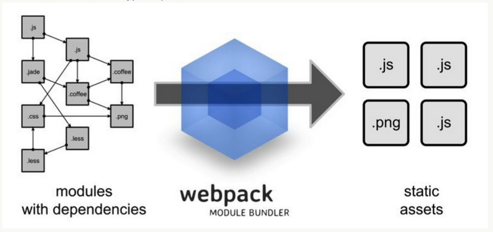

可以做的事情

> 代码转换、文件优化、代码分割、模块合并、自动刷新、代码校验、自动发布

- 需要提前掌握的内容
  - node基础、npm的使用
  - es6语法

- 最终会掌握的内容
  - webpack常见配置
  - webpack高级配置
  - webpack优化策略
  - ast抽象语法树
  - webpack中的Tapable
  - 掌握webpack流程，手写webpack
  - 手写webpack中常见的loader
  - 手写webpack中常见的plugin

## webpack基础配置

### webpack安装

- 安装本地webpack

> `webpack webpack-cli -D`

### webpack可以进行0配置

- 打包工具 -> 输出后的结果(js模块)
- 打包(支持我们的js的模块化)

如果当前目录下有node.exe执行程序，会用这个执行程序执行webpack\bin目录下的webpack.js文件

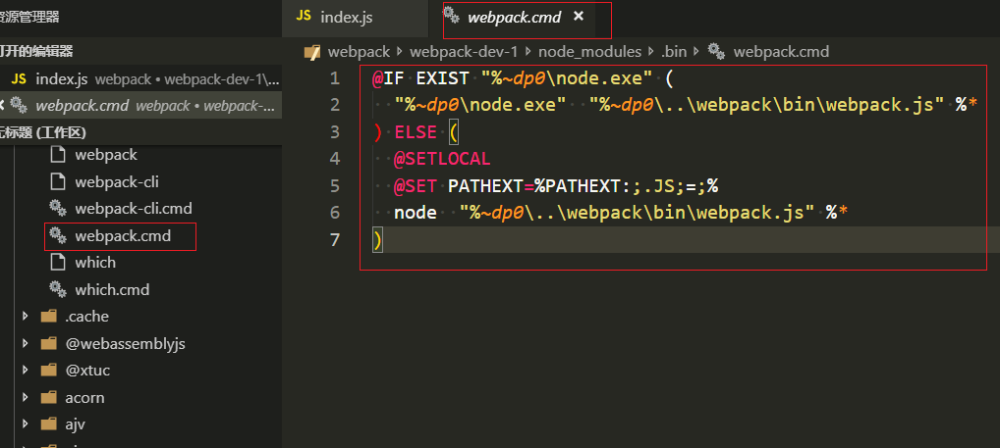

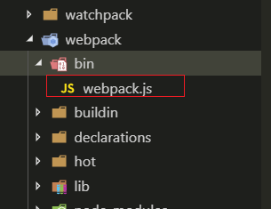

在开发时会用到`require()`来引入文件，但是如果放到浏览器时不支持node这种规范的，这样的js文件是不可以直接用于浏览器。打包之后是可以的，把语法全部转化为es5了，手动创建一个html文件，引入刚打包好的main.js文件就可以使用了

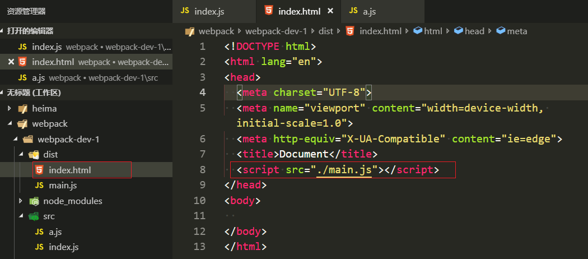

### 手动配置webpack

- 默认配置文件的名字是webpack.config.js

```javascript
// webpack 是node写出来的 node的写法
let path = require('path');

module.exports = {
  mode: 'development', // 模式 默认两种 production development
  entry: './src/index.js', // 入口
  output: {
    filename: 'bundle.js', // 打包后的文件名
    path: path.resolve(__dirname, 'dist'),// 路径必须是一个绝对路径，加__dirname是以当前目录下加一个dist目录
  }
}
```

`config.webpack.js`文件名是默认的，webpack会默认调用webpack-cli中bin下的yargs.js文件执行。`config.webpack.js`名字也是可以更改的。

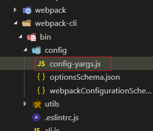

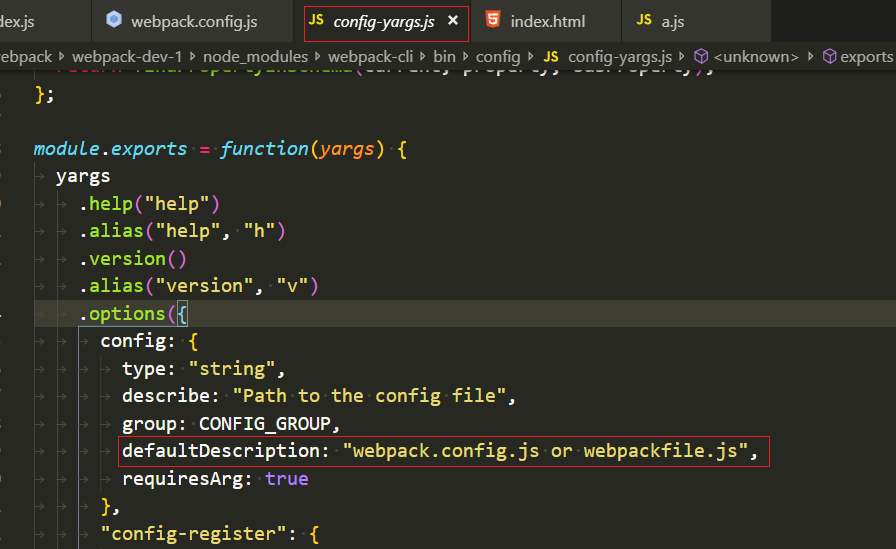

## webpack打包出的文件解析

- 打包好之后的js文件

```javascript
(function (modules) { // webpackBootstrap
  // The module cache 先定义一个缓存
  var installedModules = {};
  // "./src/index.js" : {}
  // The require function 配置了 实现了require方法  因为require是不能在浏览器中运行的
  function __webpack_require__ (moduleId) { // "./src/index.js"
    // Check if module is in cache 检查这个模块是否在缓存中
    if (installedModules[moduleId]) { // 不在缓存中
      return installedModules[moduleId].exports;
    }
    // Create a new module (and put it into the cache)
    var module = installedModules[moduleId] = {
      i: moduleId,
      l: false, // 是否加载完成
      exports: {}
    };
    // Execute the module function 第一个参数this指向，然后是module模块， module.exports空对象
    modules[moduleId].call(module.exports, module, module.exports, __webpack_require__);
    // Flag the module as loaded
    module.l = true;
    // Return the exports of the module
    return module.exports;
  }

  // Load entry module and return exports
  return __webpack_require__(__webpack_require__.s = "./src/index.js"); // 入口模块
})
  ({
    "./src/a.js": // key => 模块的路径
      (function (module, exports) { // value 函数
        eval("module.exports = 'zfpx'\n\n//# sourceURL=webpack:///./src/a.js?");
      }),
    "./src/index.js":
      (function (module, exports, __webpack_require__) {
        eval("let str = __webpack_require__( \"./src/a.js\")\r\nconsole.log(str)\n\n//# sourceURL=webpack:///./src/index.js?");
      })
  });
```

- 需要自定义webpack.config.js名字

  - 直接在终端 `npx webpack --config [filename]`

  - 知道自己配置的文件名字直接在package.json文件中写
    `webpack --config [filename]`
    在终端需要

    `npm run build`

    

    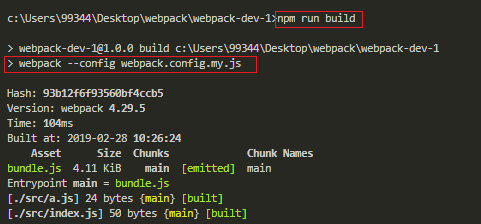

  - 如果不知道自己起的文件名字, 临时需要打包配置输入文件名

    在package.json文件中这样写

    `webpack`

    在终端需要在`--config`前面再加`--`，表示后面写的是字符串

    `npm run build -- --config [filename]`

    

    

    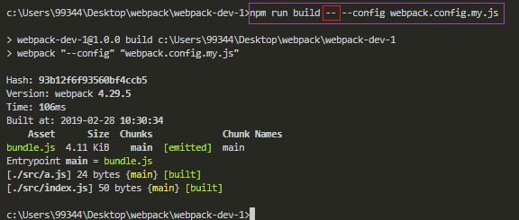

## html插件

每次打包完需要在手动打包后的文件夹中点击index.html在浏览器中打开，地址是`file:\\`，我们需要地址是`localhost:`，官方有`webpack-dev-server`，开发时直接打包进内存中，浏览器输入直接可以打开

webpack中有内置的express做的开发服务插件`webpack-dev-server`

安装

`npm i webpack-dev-server -D`

使用：并不会真的打包，会把打包好的存到内存中

命令行中：`npx webpack-dev-server`

package.json中：`npm run dev`

```json
{
  "name": "webpack-dev-1",
  "version": "1.0.0",
  "main": "index.js",
  "license": "MIT",
  "scripts": {
    "build": "webpack --config webpack.config.js",
    "dev": "webpack-dev-server" // npm run dev
  },
  "devDependencies": {
    "html-webpack-plugin": "^3.2.0",
    "webpack": "^4.35.3",
    "webpack-cli": "^3.3.5",
    "webpack-dev-server": "^3.7.2"
  }
}
```

webpack.config.js中配置

```javascript
let path = require('path');

module.exports = {
  devServer: { // 开发服务器的配置
    port: 3000, //改端口号
    progress: true, // 加进度条
    contentBase: './build', // 在哪个文件夹下起服务
    open: true, // 自动打开浏览器
    compress: true, // gzip压缩
  },
  mode: 'development',
  entry: './src/index.js',
  output: {
    filename: 'bundle.js',
    path: path.resolve(__dirname, 'build'),
  }
}
```

在打包的build文件夹中新建了index.html，引入指定的build.js，每次使用`webpack-dev-server`打包进内存，都是可以指定引入新的打包的build.js文件。但是，如果没有index.html呢，或许连build文件夹都没有。

**html-webpack-plugin**插件提供了打包后自动生成指定的自定义html模板并引入新打包的js文件，此时依然会产生两个文件，只是看不到

```javascript
// webpack.config.js
let path = require('path');
let HtmlWebpackPlugin = require('html-webpack-plugin'); // 引入html-webpack-plugin

module.exports = {
  devServer: {
    port: 3000,
    progress: true,
    contentBase: './build',
    open: true,
    compress: true,
  },
  mode: 'development',
  entry: './src/index.js',
  output: {
    filename: 'bundle.js',
    path: path.resolve(__dirname, 'build'),
  },
  plugins:[ // 数组 放着所有的webpack插件
    new HtmlWebpackPlugin({
      template: './src/index.html', // 以哪个html作为模板
      filename: 'index.html', // 设置打包后生成的html模板，不设置默认也是index.html
    })
  ]
}
```

配置各种参数：

```javascript
// webpack.config.js
let path = require('path');
let HtmlWebpackPlugin = require('html-webpack-plugin')

module.exports = {
  devServer: {
    port: 3000,
    progress: true,
    contentBase: './build',
    open: true,
    compress: true,
  },
  mode: 'production',
  entry: './src/index.js',
  output: {
    filename: 'bundle.[hash:8].js', // 打包后的文件名 [hash]加入哈希，产生不同的文件，防止覆盖和出现缓存的问题 [hash:8]只显示8位
    path: path.resolve(__dirname, 'build'),
  },
  plugins: [
    new HtmlWebpackPlugin({
      template: './src/index.html',
      filename: 'index.html',
      minify: { // 简化html
        removeAttributeQuotes: true, // 删除属性的双引号
        collapseWhitespace: true, // 折叠空行
      },
      hash: true, // 引用文件加哈希戳 防止缓存的问题
    })
  ]
}
```

打包后文件的变化


打包后模板引擎的变化


## 样式处理（1）

在index.html模板中是不允许引入css文件的，因为模板打包完会原封不动的到打包文件夹中，如果引入了css文件，此时会找不到打包文件夹外面的css文件，所以需要把css文件引入js文件中，一起打包，此时就需要css-loader，如果直接打包，js文件中是不会处理引入的 css文件的。

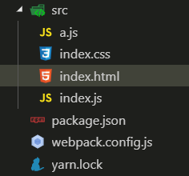

```html
<!DOCTYPE html>
<html lang="en">
<head>
  <meta charset="UTF-8">
  <meta name="viewport" content="width=device-width, initial-scale=1.0">
  <meta http-equiv="X-UA-Compatible" content="ie=edge">
  <title>Document</title>
</head>
<body>
  <!-- 模板 -->
  <link rel="stylesheet" href="./index.css">不允许
</body>
</html>
```

打包提示需要引入loader

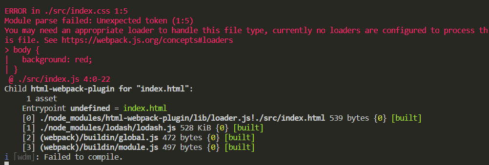

- css-loader是解析css文件里专属的语法，比如@import

```css
/* a.css */
body {
  color: yellow;
}
/* index.css */
@import './a.css';
body {
  background: red;
}
```

- style-loader是把打包好的css文件插入到模板引擎中的

```javascript
let path = require('path');
let HtmlWebpackPlugin = require('html-webpack-plugin')

module.exports = {
  devServer: {
    port: 3000,
    progress: true,
    contentBase: './build',
    open: true,
    compress: true,
  },
  mode: 'production',
  entry: './src/index.js',
  output: {
    filename: 'bundle.[hash:8].js',
    path: path.resolve(__dirname, 'build'),
  },
  plugins: [
    new HtmlWebpackPlugin({
      template: './src/index.html',
      filename: 'index.html',
      minify: {
        removeAttributeQuotes: true,
        collapseWhitespace: true,
      },
      hash: true,
    })
  ],
  module: { // 模块
    rules: [ // 规则 css-loader  解析 @import这种语法的
      // style-loader 它是把css 插入到head的标签中
      // loader的特点 希望功能单一
      // loader的用法 一个loader就用字符串
      // { test: /\.css$/, use: 'css-loader' }
      // 多个loader需要用 []
      // loader的顺序 默认是从右向左执行  从下到上执行
      // 先使用css-loader打包好之后再使用style-loader插入模板
      // { test: /\.css$/, use: ['style-loader','css-loader'] }
      // loader还可以写成 对象方式，好处是可以再写一个参数
      {
        test: /\.css$/, use: [
          {
            loader: 'style-loader',
            options: {
            }
          },
          'css-loader']
      }
    ]
  }
}
```

- 我们自己在html模板head中写的样式优先级不是最高，可以配置style-loader的属性

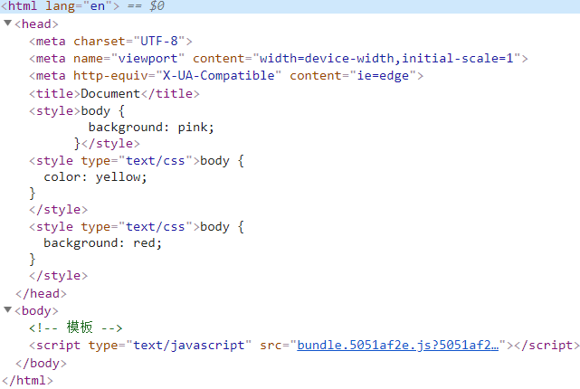

```javascript
{
    test: /\.css$/, use: [
        {
            loader: 'style-loader', // 插入模板head标签的位置
            options: {
                insertAt: 'top' // 插入head标签顶部
            }
        },
        'css-loader']
}
```

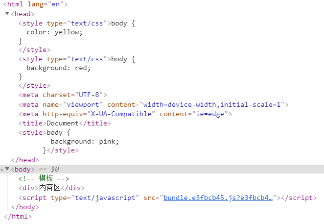

- 配置less

安装`yarn add less less-loader -D`

`less-loader`需要用`less`来进行转化

```javascript
/*index.less*/
body {
  div {
    border: 1px solid #dadade;
  }
}
/*index.js*/
let str = require('./a.js')
console.log(str)
require('./index.css')
require('./index.less')
/*webpack.config.js*/
module: {
    rules: [
      {
        test: /\.css$/,
        use: [
          {
            loader: 'style-loader',
            options: {
              insertAt: 'top'
            }
          },
          'css-loader'
        ]
      },
      {  // 可以处理less文件
        test: /\.less$/,
        use: [
          { // 把css文件插入到模板中
            loader: 'style-loader',
            options: {
              insertAt: 'top' // 插入模板head标签的位置
            }
          },
          'css-loader', // @import 解析路径
          'less-loader' // 把less 解析成 css
        ]
      }
    ]
  }
```

同样可以配置`sass`需要安装`node-sass`和`sass-loader`，`sass-loader`需要放在下面先执行

`stylus`需要安装`stylus`和`stylus-loader`

## 样式处理（2）

抽离模板中的style标签中css样式为link，抽离css插件`mini-css-extract-plugin`

安装`yarn add mini-css-extract-plugin -D`

- 引入同一个'mini-css-extract-plugin'

```javascript
/*webpack.config.js*/
let path = require('path');
let HtmlWebpackPlugin = require('html-webpack-plugin')
let MiniCssExtractPlugin = require('mini-css-extract-plugin');
module.exports = {
  mode: 'production',
  entry: './src/index.js',
  output: {
    filename: 'bundle.[hash:8].js',
    path: path.resolve(__dirname, 'build'),
  },
  plugins: [
    new HtmlWebpackPlugin({
      template: './src/index.html',
      filename: 'index.html',
    }),
    new MiniCssExtractPlugin({
      filename: 'main.css' // 抽离出css文件名
    }),
  ],
  module: {
    rules: [
      { // 我们不希望css抽离出来再放到模板的style标签中，要把style-loader去掉
        test: /\.css$/,
        use: [
          MiniCssExtractPlugin.loader,
          'css-loader'
        ]
      },
      { // 引入同一个'mini-css-extract-plugin'会全都抽离成一个文件main.css。
      // 也可以拷贝，引入两个'mini-css-extract-plugin'，分别new两个实例和用这两个的loader。比如一个用来抽离.css文件到main.css，一个用来抽离.less文件到main1.css，虽然是不同的两个css文件，但他们内容是一样的。有可能.less文件less-loader完成之后，和.css文件一起css-loader。
        test: /\.less$/,
        use: [
          MiniCssExtractPlugin.loader,
          'css-loader',
          'less-loader'
        ]
      }
    ]
  }
}

/*main.css*/
body {
  color: yellow;
}
body {
  background: red;
  transform: 45deg
}
body div {
  border: 1px solid #dadade;
}
```

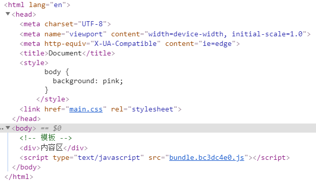

- 引入两个'mini-css-extract-plugin'，分别new两个实例和用这两个的loader

```javascript
/*webpack.config.js*/
let path = require('path');
let HtmlWebpackPlugin = require('html-webpack-plugin')
let MiniCssExtractPlugin = require('mini-css-extract-plugin');
let MiniCssExtractPlugin1 = require('mini-css-extract-plugin');
module.exports = {
  mode: 'production',
  entry: './src/index.js',
  output: {
    filename: 'bundle.[hash:8].js',
    path: path.resolve(__dirname, 'build'),
  },
  plugins: [
    new HtmlWebpackPlugin({
      template: './src/index.html',
      filename: 'index.html',
    }),
    new MiniCssExtractPlugin({
      filename: 'main.css'
    }),
    new MiniCssExtractPlugin1({
      filename: 'main1.css'
    })
  ],
  module: {
    rules: [
      {
        test: /\.css$/,
        use: [
          MiniCssExtractPlugin.loader,
          'css-loader'
        ]
      },
      {
        test: /\.less$/,
        use: [
          MiniCssExtractPlugin1.loader,
          'css-loader',
          'less-loader'
        ]
      }
    ]
  }
}
/*main.css*/
body {
  color: yellow;
}
body {
  background: red;
  transform: 45deg
}
body div {
  border: 1px solid #dadade;
}
/*main1.css*/
body {
  color: yellow;
}
body {
  background: red;
  transform: 45deg
}
body div {
  border: 1px solid #dadade;
}
```

- 希望添加的属性自动加前缀

插件包`autoprefixer`和loader`postcss-loader`

安装`yarn add postcss-loader autoprefixer`

需要新建`postcss.config.js`配置文件，这个配置文件里面要用到`autoprefixer`插件

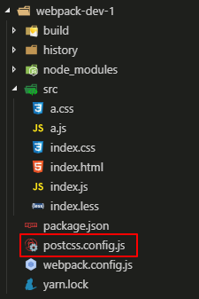

```javascript
/*postcss.config.js*/
module.exports = {
  plugins: [require('autoprefixer')({
    "browsers": [  // 9.6.0版本之后不能使用"browsers"
      "defaults",
      "not ie < 11",
      "last 2 versions",
      "> 1%",
      "iOS 7",
      "last 3 iOS versions"
    ]
  })
  ]
}
// 更改后
module.exports = {
  plugins: [require('autoprefixer')({
    "overrideBrowserslist": [
      "defaults",
      "not ie < 11",
      "last 2 versions",
      "> 1%",
      "iOS 7",
      "last 3 iOS versions"
    ]
  })
  ]
}
```

打包后的main.css

```css
/*main.css*/
body {
  color: yellow;
}
body {
  background: red;
  -webkit-transform: rotate(45deg);
          transform: rotate(45deg)
}
body div {
  border: 1px solid #dadade;
}
```


## 转化es6语法


## 处理js语法及校验


## 全局变量引入问题


## 图片处理


## 打包文件分类


## 打包多页应用


## 配置source-map


## watch的用法


## webpack小插件应用


## webpack跨域问题


## resolve属性的配置


## 定义环境变量


## 区分不同环境


## noParse


## IgnorePlugin


## dllPlugin


## happypack


## webpack自带优化


## 抽离公共代码


## 懒加载


## 热更新


## tapable介绍


## tapable


## AsyncParralleHook


## AsyncSeriesHook


## AsyncSeriesWaterfall


## webpack手写


## webpack分析及处理


## 创建依赖关系


## AST递归解析


## 生成打包结果


## 增加loader


## 增加plugins


## loader


## loader配置


## babel-loader实现


## banner-loader实现


## 实现file-loader和url-loader


## less-loader和css-loader


## css-loader


## webpack中的插件


## 文件列表插件


## 内联webpack插件


## 打包后自动发布