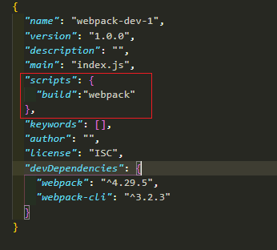

# webpack

## webpack基础配置

### webpack安装

- 安装本地webpack

> `webpack webpack-cli -D`

### webpack可以进行0配置

- 打包工具 -> 输出后的结果(js模块)
- 打包(支持我们的js的模块化)

### 手动配置webpack

- 默认配置文件的名字是webpack.config.js

## webpack打包出的文件解析

- 需要自定义webpack.config.js名字

> 知道自己配置的文件名字直接在package.json文件中写
>
> `webpack --config [filename]`
>
> 在终端需要
>
> `npm run build`

> 如果不知道自己起的文件名字, 临时需要打包配置输入文件名
>
> 在package.json文件中这样写
>
> `webpack`
>
> 在终端需要在--config前面再加--, 表示后面写的是字符串
>
> `npm run build -- --config [filename]`
>
> 

## html插件

- webpack中有express做的起服务插件webpack-dev-server

> 安装
>
> npm i webpack-dev-server -D
>
> 使用
>
> npx webpack-dev-server

