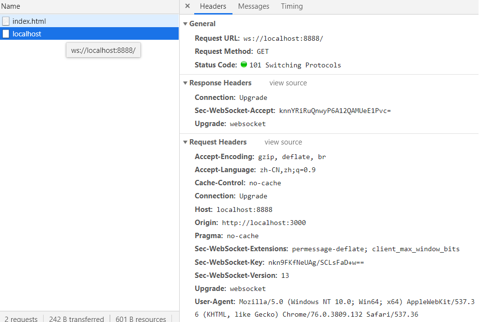

# 传输的方式

## HTTP协议

应用层协议，基于TCP协议。

### 轮询

缺点：一个客户端每秒请求一次，多个客户端的请求量太大，服务器负载大

```html
<div id="clock"></div>
<script>
    let clock = document.querySelector("#clock")
    // 轮询 每秒向服务器发送请求一次
    setInterval(() => {
        let xhr = new XMLHttpRequest()
        xhr.open("GET", "/clock", true)
        xhr.onreadystatechange = function() {
            if (xhr.readyState == 4 && xhr.status == 200) {
                console.log(xhr.responseText)
                clock.innerHTML = xhr.responseText
            }
        }
        xhr.send()
    }, 1000)
</script>
```

```javascript
let express = require('express')
let app = express();

app.use(express.static(__dirname));

app.get('/clock', function (req, res) {
  res.send(new Date().toLocaleString())
})

app.listen(8000, function () {
  console.log('server is running')
})
```

### 长轮询

默认http超时时间大概是2分钟，如果在两分钟没响应就会自动断开，当然也可以自行设置超时时间。

http没有重连机制的，这样断开会出现问题。

数据回来之后再发请求，服务器做等待处理。

```html
<div id="clock"></div>
<script>
    let clock = document.querySelector("#clock")
    // 长轮询
    function send() {
        let xhr = new XMLHttpRequest()
        xhr.open("GET", "/clock", true)
        xhr.onreadystatechange = function() {
            if (xhr.readyState == 4 && xhr.status == 200) {
                console.log(xhr.responseText)
                clock.innerHTML = xhr.responseText
                send(); // 什么时候数据回来了，再发起下一次请求
            }
        }
        xhr.send()
    }
    send();
</script>
```

```javascript
let express = require('express')
let app = express();

app.use(express.static(__dirname));

app.get('/clock', function (req, res) {
    let $timer = setInterval(() => {
        let date = new Date();
        let seconds = date.getSeconds();
        if (seconds % 5 === 0) {
            res.send(date.toLocaleString())
            clearInterval($timer)
        }
    }, 1000);
})

app.listen(8000, function () {
    console.log('server is running')
})
```

### iframe流

iframe向服务端请求，服务端一直write，不end。虽然可以持续拿到数据，但是这个请求并没有断开，页面会出现持续加载，体验很不友好。

```html
<div id="clock" style="height:200px;border:1px solid #ccc;"></div>
<iframe src="/clock" frameborder="0"></iframe>
<script>
    function setTime(ts) {
        document.querySelector("#clock").innerHTML = ts;
    }
</script>
```

```javascript
let express = require('express')
let app = express();

app.use(express.static(__dirname));

app.get('/clock', function (req, res) {
  res.header('Content-Type', 'text/html')
  // 向客户端发送一段js脚本
  // parent就是页面中的window，使用parent就可以使用外面定义的方法和变量了
  // send是写入并关闭（write和end两个方法），放在定时器中并不会每秒做出响应
  setInterval(() => {
    // 此时用send就不行了，只能写（write）不能关闭（end）,一直做出响应，永远不断开
    res.write(`
      <script>
        console.log(parent)
        parent.setTime("${new Date().toLocaleString()}")
      </script>
    `)
  }, 1000);
})

app.listen(8000, function () {
  console.log('server is running')
})

```

### EventSource流

**不能跨域**。

标签页不会出现持续加载的不友好体验，同时比轮询和长轮询减少了请求次数，中间的连接是持续的，不会中断。轮询和长轮询会持续发请求。

webpack中的热更新用的就是EventSource，每次改变源码不需要手动刷新页面，会自动把代码更改的部分替换掉原来的部分。

```html
<div id="clock"></div>
<script>
    let eventSource = new EventSource("/clock")
    let clock = document.querySelector("#clock")
    // 监听服务器发过来的消息
    // 事件名是服务器自定义的
    eventSource.onopen = function(event) {
        console.log(event)
        let message = event.data
        clock.innerHTML = message
    }
    // 监听连接请求失败的错误事件
    eventSource.onerror = function() {}
</script>
```

```javascript
let express = require('express')
let app = express();

let counter = 0;
app.use(express.static(__dirname));

app.get('/clock', function (req, res) {
    res.header('Content-Type','text/event-stream')
    let $timer = setInterval(() => {
        // 最后要加\n\n代表结束
        res.write(`id:${counter++}\nevent:open\ndata:${new Date().toLocaleString()}\n\n`)
    }, 1000);
    // 每次刷新页面会断开连接，再次连接。但定时器没有销毁，id传出的值会counter++多次，几个定时器就会累加几次。所以要销毁。
    // close事件：当服务器关闭时触发。
    res.on('close',function(){
        clearInterval($timer)
    })
})

app.listen(8000, function () {
    console.log('server is running')
})
```

## websocket

应用层协议，它基于TCP传输协议，并复用HTTP的握手通道。和HTTP是并行的关系。

优势：

- 支持双向通信，实时性更强。
- 更好的二进制支持。
- 较少的控制开销。连接创建后，ws客户端、服务端进行交换数据交换时，协议控制的数据包头部比较小。
- **可以跨域**

### 简单实现：利用`ws`启动一个websocket服务器

安装：`npm i ws`

```javascript
let express = require('express')
let app = express()
app.use(express.static(__dirname))

app.listen(3000)

let WebSockerServer = require('ws').Server;
// 起服务的端口号和websocket的端口号不能一样。跨域是肯定的，websocket本身也是支持跨域的。
let server = new WebSockerServer({ port: 8888 })
// socket 插座
// 监听连接
server.on('connection', function (socket) {
    console.log('2.服务器端监听到了客户端的连接')
    // 监听客户端发过来的消息
    socket.on('message', function (message) {
        console.log('4.服务端接收客户端连接过来的消息', message)
        // 发送消息
        socket.send('5.服务器说：' + message)
    })
})
```

```html
<script>
    let socket = new WebSocket("ws://localhost:8888")
    socket.onopen = function() {
        console.log("1.客户端将连接服务器")
        socket.send("3.客户端说")
    }
    socket.onmessage = function(event) {
        console.log("6." + event.data)
    }
</script>
```



`http状态码101`：切换协议成功。用websocket向服务器发请求第一次仍然是http协议，但请求到达服务器会切换到websocket协议。目前出现101只有websocket了。

Request Headers：

- Connection: Upgrade 连接的协议要升级
- Upgrade: websocket 要升级成websocket协议
- Sec-WebSocket-Version: 13 要升级的websocket协议的版本号
- Sec-WebSocket-Key: nkn9FKfNeUAg/SCLsFaD+w== 通过websocket协议传递key给websocket服务器，服务器通过固定的算法响应一个key，如果响应回的key是浏览器想要的，那就切换协议成功。

Response Headers：

- Connection: Upgrade 连接的协议要升级
- Upgrade: websocket 要升级成的协议
- Sec-WebSocket-Accept: knnYRiRuQnwyP6A12QAMUeE1Pvc= 响应的key，浏览器识别之后，就会升级成websocket协议，没有识别就会升级协议失败。

### 手写websocket服务器

- 浏览器识别websocket服务器生成key的算法过程

按照sha1算法，把初始key和'258EAFA5-E914-47DA-95CA-C5AB0DC85B11'字符串拼接进行base64转换，生成新的key

```javascript
let key = 'nkn9FKfNeUAg/SCLsFaD+w==';
// 'knnYRiRuQnwyP6A12QAMUeE1Pvc='; // 看结果是否是该key
const CODE = '258EAFA5-E914-47DA-95CA-C5AB0DC85B11';
let crypto = require('crypto');
let result = crypto.createHash('sha1').update(key + CODE).digest('base64');
console.log(result);
```

要知道TCP协议，TCP协议的握手过程

```html
<script>
    let socket = new WebSocket("ws://localhost:9999")
    socket.onopen = function() {
        console.log("1.客户端将连接服务器")
        socket.send("3.客户端说")
    }
    socket.onmessage = function(event) {
        console.log("6." + event.data)
    }
</script>
```

起服务

```javascript
let express = require('express')
let app = express()
app.use(express.static(__dirname))

app.listen(3000)
```

另起一个websocket服务

```javascript
// 启动一个TCP协议的服务器
let net = require('net')
const CODE = '258EAFA5-E914-47DA-95CA-C5AB0DC85B11';
let crypto = require('crypto');
let server = net.createServer(function (socket) {
    // once来自于EventEmitter 
    // on 每次都会执行
    // once 只会执行一次
    socket.once('data', function (data) {
        data = data.toString();
        if (data.match(/Connection: Upgrade/)) {
            let rows = data.split('\r\n'); // 拆分成数组
            rows = rows.slice(1, -2); // 数组截取
            let headers = {};
            rows.reduce((memo, item) => {
                let [key, value] = item.split(': '); // 数组中的每一项都有: 冒号空格，将其前后拆分成key,value
                memo[key] = value;
                return memo;
            }, headers)
            console.log(headers);
            if (headers['Sec-WebSocket-Version'] == '13') {
                let SecWebSocketKey = headers['Sec-WebSocket-Key'];
                let SecWebSocketAccept = crypto.createHash('sha1').update(SecWebSocketKey + CODE).digest('base64');
                let response = [
                    'HTTP/1.1 101 Switching Protocols',
                    'Upgrade: websocket',
                    'Connection: Upgrade',
                    `Sec-WebSocket-Accept: ${SecWebSocketAccept}`,
                    '\r\n'
                ].join('\r\n'); // 响应字符串
                socket.write(response);
                // 后面所有的格式都是基于websocket协议的
                socket.on('data', function (data) {

                })
            }
        }
    })
})
server.listen(9999);

/*
【请求行】
GET ws://localhost:8888/ HTTP/1.1 \r\n
【请求头】
Connection: Upgrade\r\n
Upgrade: websocket\r\n
Sec-WebSocket-Version: 13\r\n
Sec-WebSocket-Key: nkn9FKfNeUAg/SCLsFaD+w==\r\n
\r\n
【无请求体】：因为没有请求体 有两个空行就结束了
 */

/*
【响应行】
HTTP/1.1 101 Switching Protocols\r\n
【响应头】
Upgrade: websocket\r\n
Connection: Upgrade\r\n
Sec-WebSocket-Accept: knnYRiRuQnwyP6A12QAMUeE1Pvc=\r\n
【无响应体】
*/
```

