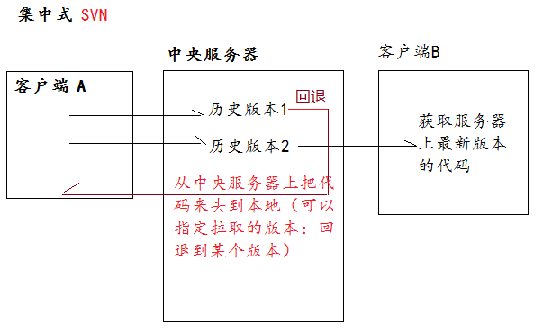
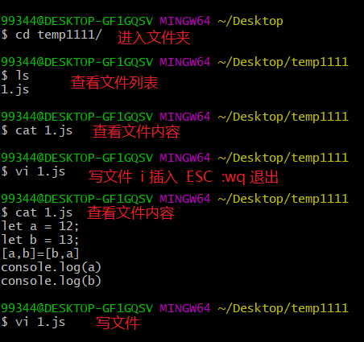
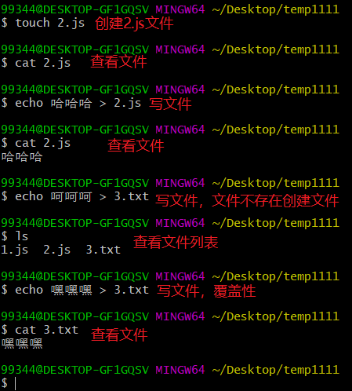
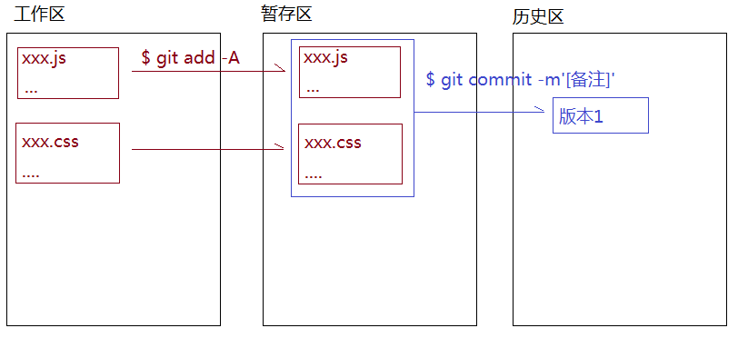
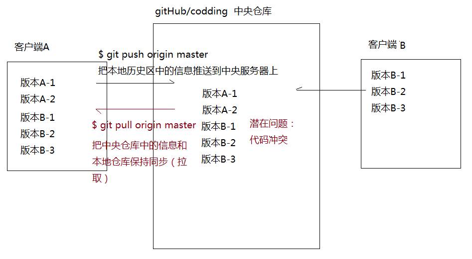
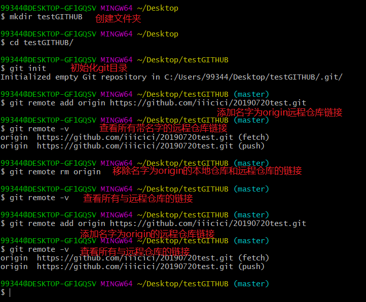
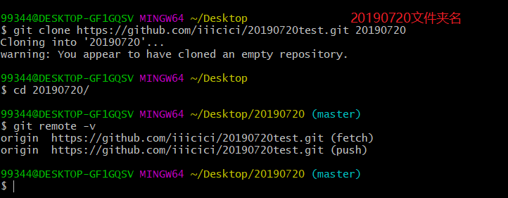
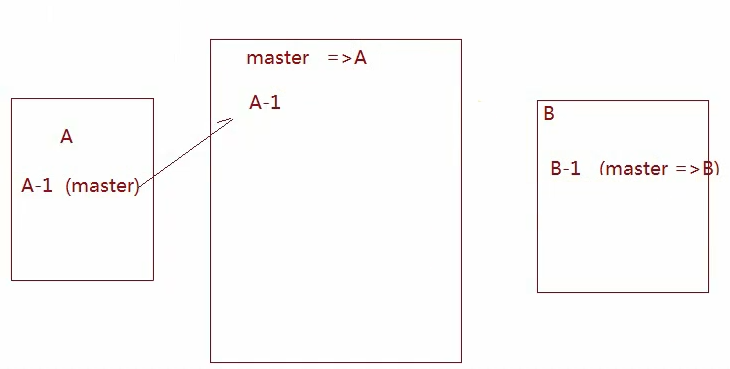

# GIT

## 集中式对比分布式

GIT：分布式版本控制系统

版本控制系统：开发中我们把每一次的修改都有效的进行记录（记录成一个版本），后期如果需要回退到原有的某个版本或者是用当前的和某一个版本进行比较等，都可以有效的进行管理。
常用的版本控制系统：SVN（集中式） / GIT（分布式）

- 分布式版本管理系统的特点
  所谓分布式，就是每一个开发者的本地客户端都是一个完整的仓库，都能记录历史版本信息，这样不需要联网，我们也能生成历史版本记录，也可以快速回退到某个版本
  单人开发：根本不需要中央服务器，不需要联网，在自己的电脑上就可以保留历史版本。
  多人开发：如果没有中央服务器，只是不能团队协作，但是可以生成历史版本
  

- 集中式版本管理系统的特点
  所有的历史版本都是再中央服务器上建立的，本地客户端只是一个开发的环境，开发完需要推到服务器上生成历史版本，需要回退到某个版本，也需要从中央服务器拉取。=>“必须连接上中央服务器才可以” **必须联网**

  不论是单人开发还是多人开发，都不能脱离中央服务器。
  限制情景：例如上传到中央服务器上，自己出差在飞机上，老板说代码有问题需要改，但是自己电脑上的代码是最新版，不是上一个版本，没有办法回退到上一个版本，必须联网（哪怕是局域网）回退到上一个版本才可以继续工作，限制了工作的继续。

  

- GIT和SVN的区别
  **本质区别**：GIT有本地仓库，是可以保留历史版本的，有中央服务器可以协作开发。而SVN只有中央服务器，中央服务器必须联网才能推送历史记录，并且进行协作开发。
  GIT是按照源数据（文件流）来实现文件传输的，而SVN是按照文件传输的，所以GIT比SVN传输速度更快。

- Linux团队开发的git，所以git中的命令大部分都是linux命令

## 常用的LINUX命令

WINDOWS操作系统：DOS窗口和DOS命令

LINUX服务器操作系统：LINUX命令（MAC）

```
ls -l/-a：查看当前目录结构（-a是可以看见所有的：包含隐藏的）
cd xxx[路径地址]：进入到执行的文件夹中（进入的路径地址，可以粘贴或者拖文件）
	cd /：根目录
	cd ./：当前目录
	cd ../：上级目录
clear：清屏
mkdir：创建文件夹
touch：创建空的文件
vi：向文件中插入或者管理一些内容
	i：进入到插入模式
	ESC + :WQ  退出内容的插入，把刚才编辑的内容进行保存
echo xxx > xxx.txt 或者 echo xxx >> xxx.txt：向指定的文件中输入内容，把前面的内容插入到后面的文件中（覆盖性），如果没有这个文件会创建文件写入内容
cat：查看文件中的内容
cp：拷贝
rm：删除文件 -r（递归删除）-f（强制删除，一旦删除无法还原）-rf（既有递归又有强制删除）
```






## 基础工作流程

GIT的常规流程：

- 每一个GIT仓库都有三个区

  - 工作区：写代码
    `$git add -A/.`把当前工作区修改的内容全部提交到暂存区（可以指定具体提交的文件`$git add xxx.js`）
  - 暂存区：临时存放每一次修改的代码，但是并没有生成历史版本
    `$git commit -m[备注]`把暂存区的内容提交到历史区，生成一个历史版本（我们需要写备注信息，声明当前版本的特点）
  - 历史区：生成最终版，有版本号

  

- 创建GIT仓库：`$git init`
- 每一次区域间信息的提交都不会删除原有区域的内容，这样保证，下一次提交，只是把区域对比出来不一样的内容提交，而不是所有。
- `$git status`：查看当前修改的文件处于哪一个区域。红色：工作区；绿色：暂存区；看不见：已经提交到历史区，三区保持一致了
- `$git rm --cached xxx.xx`：把暂存区的某一个文件删除（提交到暂存区的内容不好，我们可以删除）
- `$git rm --cached . -r`：删除暂存区中所有提交的


`.git`文件夹是关键，里面存放暂存区和历史区的文件


- `$git checkout xxx.xx`提交到暂存区一份，把工作区内容改了，但是改的东西不好，想把暂存区上次提交的内容撤回到工作区（覆盖工作区新写的内容）
  暂存区内容没有消失，只是把工作区最新修改的信息给覆盖了，让工作区和暂存区保持一致


- `$git diff`：工作区vs暂存区代码区别
- `$git diff master`：工作区vs历史区master分支代码区别
- `$git diff --cached`：暂存区vs历史区代码区别

## 一些细节问题

- 如果是第一次使用git，生成历史版本的时候，需要提供身份认证
  - `$git config l`：查看所有配置信息
  - `$git config --global user.name 'xxx'`：添加user.name
  - `$git config --global user.email 'xxx'`：添加user.email

- 真实项目中，并不是所有的文件都和项目有关系（例如：.idea是webStorm生成的配置文件夹和项目没关系），也不是所有的文件都提交（例如：node_modules中的内容太大了，也不需要提交）
  `.gitignore`GIT提交的忽略文件

  ```
  # dependencies
  /node_modules
  
  # testing
  /coverage
  
  # production
  /build
  
  # misc
  .DS_Store
  .env.local
  .env.development.local
  .env.test.local
  .env.production.local
  
  npm-debug.log*
  yarn-debug.log*
  yarn-error.log*
  
  .idea
  ```

- `$git log`查看历史版本信息，如果信息太长，按Q结束

## 关于GIT的回滚

- 代码回滚操作

  - `$git checkout .`：把暂存区内容回滚到工作区（一旦回滚，工作区内容无法恢复）

  - `$git reset HEAD .`：把当前暂存区的内容回滚到上一个暂存区，目的是为了把上一个暂存区内容回滚到工作区
    此时工作区已经变成1+100，想要回滚到1+1，需要把当前暂存区的内容1+10回滚到上一个暂存区的1+1。需要先执行`$git reset HEAD .`把最近暂存区中的内容删除掉，紧接着执行`$git checkout .`把上一个暂存区内容回滚到工作区

    

  - `$git reset --hard [版本号]`：在历史区中回退到某一个版本（强制把暂存区和工作区都变成回退后的版本）
    [版本号]输入前七位就好，前几位都可以

  - `$history > xxx.txt`把历史操作步骤输出

## 团队协作开发的基础流程

1. 基础流程操作
   

   1. 首先创建中央仓库：可以基于gitHub/codding来创建（**最好不要创建空仓库，因为空仓库中没有任何分支，只有提交一次历史信息才会生成msater分支**）
      把开发者都列入仓库的开发群组中，这样每一个开发者用自己的gitHub账号，都有权限操作这个仓库了（当然不这样做也可以，所有开发者用统一的一个账号也可以，为了防止不知道是谁提交的，我们需要让每一个客户端在本地的GIT全局配置中，设置和gitHub相同的用户名和邮箱`git config --global user.name 'xxx'`）
      
      会收到一封邮件，接受邀请

   2. 创建客户端本地仓库（一个开发者就是一个单独仓库），还需要让本地的仓库和远程仓库保持关联，这样才可以实现后续的信息同步

      - 一般的方式
        `$git init`创建本地仓库
        `$git remote add [远程地址名(默认origin)] [远程仓库GIT地址]`让本地仓库和远程仓库保持连接
        `$git remote -v`查看连接（origin是连接的名称，一般都用这个名字，当然自己可以随便设置）
        `$git remote rm origin`移出本地仓库和远程仓库的链接
        `$git remote update origin`更新链接通道
        
        增加了一个名为aaa的远程仓库
        

      - 更简单的方式：只要把远程仓库克隆到本地，就相当于创建本地仓库，并且自动建立了链接，并且把远程仓库中的内容也同步到了本地

        `$git clone [远程仓库地址] [本地仓库文件夹名字]（不写默认是仓库名字）`
        这一步操作相当于上面的三步：创建文件夹之后`$git init`；`$git remote add [远程地址名(默认origin)] [远程仓库git地址]`；`$git pull [git地址名] master`

        

   3. 各自和中央服务器同步信息
      推送：`$git push origin master`（每一次PUSH之前最好都pull一下：如果有冲突在本地处理一下冲突，然后再推送。**任何一个中央仓库在刚创建时是没有分支的，第一次pull是拉取不了的，第一次push才会创建msater分支**）
      拉取：`$git pull origin master`
      使用**空**中央仓库，A push之后，B pull不下来的原因是A提交了自己的master分支，中央仓库中的master是A的，B指定origin master时，中央仓库中的master是A的，并不是中央仓库的

      
      下面不是空中央仓库的流程：

      
      

## 分支处理和团队协作


