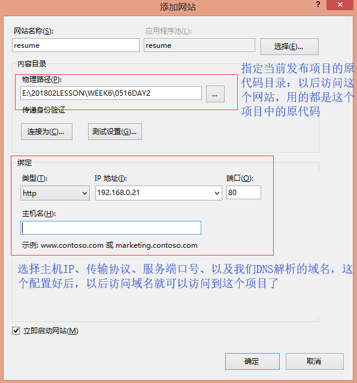

# AJAX

## 职业规划(技术分享)

- 职业规划的建议

> **开放分享**
> 1. 写一个属于自己的博客
> 	把自己的学习笔记以及到其他文章中去学习借鉴的, 然后把文章和学习感想发表出来...
> 2. 经常参加圈内的技术交流分享
> 3. 打造自己的自媒体
- 搭建自己的博客
> 1. 可以基于第三方平台搭建(新浪博客, CSDN...)
> 2. 基于gitHub发布页面(HEXO)
> 3. 创建博客项目, 并且购买域名和服务器进行发布推广
> 
- 打造自己的博客网站
> 开发项目(项目代码在自己的本地)
> 项目开发
> 1. 需要一台自己的服务器(万网上购买,被阿里云收购了)
> 	购买 虚拟云服务器 / 独立主机 (虚拟云服务器是分成好多份, 一份卖一个, 独立主机是直接拥有一个自己的大服务器)
> 	购买服务器成功后会有一个外网的IP地址(外网IP: 任何用户通过这个IP地址都可以访问到你的服务器)
> 2. 需要买一个域名
> 	在万网购买
> 	尽量买.com/.cn...
> 3. 把域名进行DNS解析: 把域名和服务器关联在一起(解析的时候需要填写服务器的外网IP), 以后访问域名就相当于访问服务器
> 	DNS(Domain Name Syatem, 域名系统), 万维网上作为域名和IP地址相互映射的一个分布式数据库(域名解析成功会在DNS系统中记录一条信息 "www.xxx.com  xxx.xxx.xx.xxx"保证以后访问域名, 可以直接找到外网IP, 通过外网IP访问到服务器)
> 	还需要进行备案(合法)
> 4. 一台服务器可以发布很多项目, 服务器买回来还不算结束, 我们还需要在服务器上进行项目发布, 此时需要一些发布WEB站的工具: IIS(C# .Net 发布在WINDOWS SERVER系统), APACHE TOMCAT(PHP/JAVA... 发布在LINUX系统), NGINX(用的最多的)...
> 	指定当前域名访问服务器后, 到底执行的是哪一个项的源代码(让域名和服务器上的项目关联到一起)


- 内网IP(局域网) 

> 在一个区域内, 大家连接的是同一个网络(准确来说: 连接同一个wifi不一定是同一个网络, 连接不同的wifi也可能是相同的网络, 一切都看路由器交换机的配置), 这就是局域网.
>
> 
>
> 在同一个局域网下, 成员可以相互访问(你的电脑连接了A网络, 手机也连接了A网络, 那么手机可以访问电脑上的一些信息了, 这样可以做移动端开发的时候手机联调)
> HBuilder也提供了联调的功能(代码上加断点, 手机访问, 程序会走断点)
- 怎么把自己本地的代码上传到远程服务器

> 服务器上不允许安装除了开发需要的项目环境项以外的任何东西(保持服务器的干净)
> 我们一般都是基于FTP上传(有很多FTP上传的工具: FileZilla)



##客户端和服务器端交互模型
- 面试必问问题: 
> 打开一个浏览器, 在地址栏输入一个网址, 按下ENTER键, 到看到整页面, 中间都经理了哪些事情?

**HTTP请求阶段: 向服务器发送请求**
> 1. 浏览器首先向DNS域名解析服务器发送请求
> 2. DNS反解析: 根据浏览器请求地址中的域名, 到DNS服务器中找到对应的服务器外网IP地址
> 3. 通过找到的外网IP, 向对应的服务器发送请求(首先访问的是服务器的WEB站点管理工具: 准确来说是我们先基于工具在服务器上创建很多服务, 当有客户端访问的时候, 服务器会匹配出具体是请求哪个服务)
> 4. 通过URL地址中携带的端口号, 找到服务器上对应的服务, 以及服务所管理的项目源文件

**HTTP响应阶段: 服务器把客户端需要的内容准备好, 并且返回给客户端**

> 5. 服务器端根据请求地址中的路径名称, 问号传参或者哈希值, 把客户端需要的内容进行准备和处理
> 6. 把准备的内容响应给客户端(如果请求的是HTML或者CSS等这样的资源文件, 服务器返回的是资源文件中的源代码[不是文件本身])

**浏览器渲染阶段**
> 7. 客户端浏览器接收到服务器返回的源代码, 基于自己内部的渲染引擎(内核)开始进行页面的绘制和渲染
>   首先计算DOM结构, 生成DOM TREE
>   自上而下运行代码, 加载CSS等资源内容
>   根据获取的CSS生成带样式的RENDER TREE
>   开始渲染和绘制


- 我们把完整的 请求+响应 称之为"HTTP事物"
> 事务就是完整的一次操作, 请求和响应缺一不可

- 一个页面完全加载完成, 需要向服务器发起很多次HTTP事务操作
> 一般来说: 首先把HTML源代码拿回来, 加载HTML的时候, 遇到link/script/img[src]/iframe/video和audio[没有设置preload='none']...都会重新和服务器端建立HTTP事务交互
> **特殊情况**: 如果我们做了资源缓存处理(304), 而且即将加载的资源在之前已经加载过了, 这样的操作和传统的HTTP事务有所不一样, 他们是从服务器和浏览器的缓存中读取数据, 比传统的读取快很多

- HTTP报文
> 客户端向服务器发送请求, 以及服务器把内容响应给客户端的时候, 中间相互传递了很多内容(客户端把一些内容传递服务器, 服务器把一些内容响应给客户端), 我们把传递的内容统称为"HTTP报文"
## 一个完整的URL各部分分析

**下面拿网址展开知识**:`http://www.zhufengpeixun.cn:80/stu/index.html?name=xxx&age=25#teacher`

- URL/URN/URI

> URI=URN+URL
> URI: 统一资源标识符
> URL: 统一资源定位符
> URN: 统一资源名称


- 传输协议

> 用来传输客户端和服务器端交互的信息的
> HTTP: 超文本传输协议(除了传递普通的文本, 还可以传递文件流或者进制编码等信息), 是目前最常用的WEB传输协议
> HTTPS: 基于SSL(Secure Sockets Layer 安全套接层)加密的HTTP传输协议, 比HTTP更加的安全(涉及支付的网站一般都是基于HTTPS完成的)
> FTP: 文件传输协议, 一般用来实现资源文件在服务器上的上传下载
> (类似于快递, HTTPS安全类似邮政, HTTP类似普通的快递顺丰)

- 域名(Domain Name)

> 一级域名(顶级域名): www.qq.com
> 二级域名: sports.qq.com
> 三级域名: kbs.sports.qq.com
> .com 供商用的国际域名
> .cn 供商用的中文域名
> .net 用于网络供应服务商(系统类的经常使用NET域名)
> .org 用于官方组织
> .edu 用于教育元宵
> .gov 用于政府机构

- 端口号

> 用来区分同一台服务器上不同服务的标识(类似WEB服务管理器常见服务的时候可以指定), 不同服务之间一般是不能使用相同的端口号的
> HTTP 默认端口号80
> HTTPS 默认端口号443
> FTP 默认端口号21
> 如果当前网站服务, 采用的是协议对应的默认端口管理, 那么当用户输入网址的时候可以不指定端口号, 浏览器会默认对用户使用默认的端口传递给服务器

> 一台服务器上的端口号范围: 0~65535之间

> webStorm预览页面: webStorm把自己的电脑当做服务器, 在服务器上创建一个服务, 端口号是63342, 自己电脑上的浏览器预览自己电脑上的服务, 属于本机服务请求, 用localhost(127.0.0.1)本地域名即可

> 服务器上安装一款应用都可能会作为一个服务, 占用一个端口号

- 请求路径名称

> path
> pathname
> 例如: /stu/index.html 一般都是请求当前服务对应的项目目录中, stu文件夹中的index.html页面. 但是也有特殊情况, 就时当前的URL是被"伪URL重写"的, 我们看到的URL请求其实不是真实的请求(例如: https://item.jd.com/4679424.html 这个URL就是被重写的，
>
> 它的真实URL地址很可能是 https://item.jd.com/detail.jsp?id=4679424, 其实就是跳转到详情页, 通过问号传递不同的产品编号, 展示不同的产品详情信息, 但是jsp这种服务器渲染的动态页面不能被搜索引擎收录, 不利于页面的SEO, 所以我们会把动态页面静态化, 这也就用到了URL重写技术)


> 例如: /stu/info 这种没有任何后缀信息, 一般都不是用来请求资源文件的, 而是用于AJAX数据请求的接口地址(如果后缀是.json类的, 也是同理), 
> 但是有一种除外 /stu/info/ 这种的很可能不是接口地址, 而是没有指定请求的资源名称, 服务器会请求默认的资源文件, 一般都是index.html/default.html...

> DHTML: 动态页面, 泛指当前页面中的内容不是写死的而是动态绑定的, 例如: jsp/.php/.aspx... 这些页面中的数据都是基于AJAX或者是后台编程语言处理, 由服务器端渲染, 最后把渲染后的结果返回给客户端呈现的
>
> .jsp是JAVA用的, .php是PHP用的, .asp/.aspx是C#或者.NET用的

- 问号传参及哈希值

> ?xxx=xxx&...#xxx
> 在HTTP事务中, 问号传参是客户端把信息传递给服务器的一种方式(也有可能是跳转到某一个页面, 把参数值传递给页面用来标识的)
> 哈希值一般都跟客户端服务器端交互没什么关系, 主要用于页面中的锚点定位和HASH路由切换
## HTTP报文

> 起始行: 请求起始行, 响应起始行
> 首部(头): 请求头, 响应头, 通用头
> 主体: 请求主体, 响应主体

- General 通用头

```
Request URL: http://www.zhufengpeixun.cn/  请求地址
Request Method: GET  请求方式:GET/POST/DELETE/PUT/HEAD/OPTION...
Status Code: 304 Not Modified   响应的HTTP状态码
Remote Address: 125.39.174.137:80  主机地址(服务器外网IP地址)
Referrer Policy: no-referrer-when-downgrade
```

- Request Headers 请求头 

> 客户端设置，服务器接收
```
GET / HTTP/1.1  起始行(描述当前请求的一些基本信息：用的是1.1版本传输协议进行内容传输的)
Host: www.zhufengpeixun.cn
Connection: keep-alive
Cache-Control: max-age=0
Upgrade-Insecure-Requests: 1
User-Agent: Mozilla/5.0 (Windows NT 6.3; Win64; x64) AppleWebKit/537.36 (KHTML, like Gecko) Chrome/66.0.3359.139 Safari/537.36
Accept: text/html,application/xhtml+xml,application/xml;q=0.9,image/webp,image/apng,*/*;q=0.8
Accept-Encoding: gzip, deflate
Accept-Language: zh-CN,zh;q=0.9
Cookie: ... cookie信息一般都是放到头文件中实现和服务器端的数据通信的
If-Modified-Since: Sun, 06 May 2018 10:02:42 GMT
```

- Response Headers 响应头
> 服务器端设置，客户端获取
```
HTTP/1.1 304 Not Modified  响应起始行（HTTP状态码）
Date: Tue, 22 May 2018 09:18:56 GMT  服务器响应内容时候的“服务器端时间”（客户端获取这个时间的时候已经和真实的时间产生误差了，因为服务器返回内容到客户端接收到，也是需要时间的），并且这个时间是格林尼治时间（比北京时间慢8小时，北京时间是GMT+0800）
Connection: keep-alive
ETag: "700a6f-17f43-56b86a77513d3"
Vary: Accept-Encoding,User-Agent
Server: yunjiasu-nginx  管理WEB服务的工具
CF-RAY: 41ee32c192db66b8-TSN
```

- 响应主体

> 服务器返回的是什么就是什么

- 请求主体

> Request Payload / Form Data
>
> 客户端传递给服务器的内容


### 会HTTP查看的重要性

> 了解HTTP报文以及如何查看对未来工作开发和BUG调试至关重要
> 以后涉及到交互功能(前端<=>后台)出现问题, 都按照如下方式查找问题原因
>   A: 打开控制台, 在network中找到当前交互的请求地址, 点击进去看详情
>   B: 如果是传递给服务器的参数或者方式错误[前端问题]
>   C: 如果服务器返回的信息有错误或者和API接口文档规定的内容不一样[后台问题]
>   D: 如果返回数据是对的, 但是展示有问题[前端问题]
> 确定是自己前端的问题后, 基于断点(或者代码中的debugger)或者控制台输出等方式, 开始逐步调试即可

### 客户端和服务器端信息交互的方式
- 客户端传递给服务器

> 1. 问号传参
>   请求的URL地址末尾通过问号传参方式, 把一些信息传递给服务器
>   /stu/info?id=12&lx=man
> 2. 设置请求头
>   客户端把需要传递给服务器的内容设置到请求头信息中(自定义请求头), 服务器可以通过接收请求头信息把内容得到
> 3. 设置请求主体
>   xhr.send([AJAX SEND中传递的内容, 就是客户端设置的请求主体内容, 服务器端可以接收到这些信息的])

- 服务器返回给客户端

> 1. 设置响应头信息
>   例如把服务时间通过响应头返回给客户端, 客户端通过获取响应头信息得到这个时间(响应头返回的速度是优先于响应主体的)
> 2. 设置响应主体
>   主要的返回信息都在响应主体中
